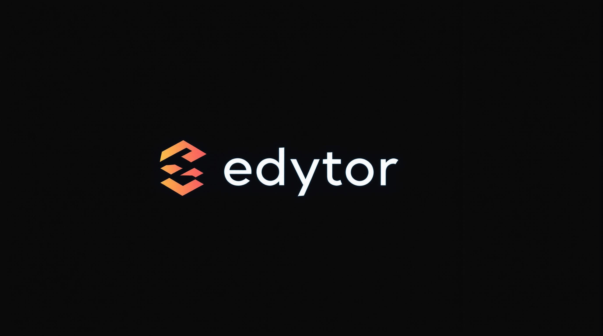

<div align="center">
  

<p>A collaborative block editor for Svelte 5, on a Yjs v14 engine</p>

[](https://github.com/beynar/edytor/actions/workflows/ci.yml)
[](https://opensource.org/licenses/MIT)
[](https://svelte.dev)

<p>
    <a href="https://edytor.dev/docs">Documentation</a> •
    <a href="#quick-start">Quick start</a> •
    <a href="https://edytor.dev/docs/reference/migration">Changelog</a>
  </p>
</div>

Edytor aims to be for Svelte what Slate.js is for React: a heavily customizable editor with an API to build any kind of collaborative rich text editor.

> **Work in progress.** Edytor is a pre-release (`0.1.0-next.40`, `edytor@next` on npm) and not ready for production; the API changes between releases without a compatibility layer. The untagged `edytor@0.0.11` on npm predates the current API. Issues and PRs are welcome: when you report a bug, include the document's JSON value.

## Features

- **Notion-style editing out of the box.** `<Edytor />` alone is a rich text editor with images and block handles: headings, toggle headings, lists, to-dos, toggles, callouts, quotes, dividers, ten marks and Notion's hotkeys. Add the Notion theme, a block menu (block colours; drag one block, or every block the selection covers), a slash menu, a selection toolbar, markdown shortcuts (`markdownShortcutsPlugin`) and code blocks.
- **Pages and a table of contents, opt-in.** `createPagePlugin` links a block to another document (a page per room, opened and named by your app), and `tocPlugin` lists the headings live ([Page](https://edytor.dev/docs/plugins/page), [Table of contents](https://edytor.dev/docs/plugins/table-of-contents)).
- **Columns, opt-in.** List `columnsPlugin` for Notion's multi-column layouts: drag a block to the edge of another to put them side by side, or pick "2 columns" to "5 columns"; drag the gap to resize. Layouts converge across collaborators and the room ([Columns](https://edytor.dev/docs/plugins/columns)).
- **Tables, opt-in.** List `tablePlugin` for Notion's simple table: cells of text, <kbd>Tab</kbd> between them, rows and columns added, moved and deleted from the table's edges and grips, resizable columns, header row and column, HTML tables pasted and copied. Concurrent row and column edits converge on every replica ([Table](https://edytor.dev/docs/plugins/table)).
- **Mentions, page links and your own triggers.** `createMentionPlugin` (`@` people) and `createPageLinkPlugin` (`[[` pages) take your app's search; a plugin's `inputRules` (`:smile:` → 😄) and `triggers` (a menu on a typed character) declare the rest ([Input rules and triggers](https://edytor.dev/docs/plugins/input-rules)).
- **Comments, opt-in.** `createCommentsPlugin` adds Notion's comment threads: select text, press Comment, and the thread shows in a sidebar beside it with replies, Resolve and Re-open. The room keeps the threads beside the document and sends each change live; the anchor follows the text through edits and is not copied ([Comments](https://edytor.dev/docs/plugins/comments)).
- **Your markup.** Blocks, marks and inline atoms render through your Svelte snippets; the slash menu, toolbar, block menu and handles take a snippet and keep their behavior.
- **Your language.** Every word the chrome shows or says, slash keywords included, comes from a labels dictionary each plugin takes; English by default ([Localization](https://edytor.dev/docs/customization/localization)).
- **Synced properties.** `block.data`, `atom.data` and `edytor.data` read and write like plain objects (`bind:value={block.data.title}`); each property and each array item syncs on its own, so concurrent edits of different properties, or of different items of one array, merge.
- **AI suggestions.** `edytor.suggestions.add(position, content)` proposes text, paragraphs, lists, to-dos or images after, before or inside a block, at the end of its text, or in place of the selection; it streams in, shows only on your screen, and becomes one undo step when accepted ([Suggestions](https://edytor.dev/docs/editor/suggestions)).
- **Plugins that can veto anything.** Every command is prepared before it writes; plugins see the command and each planned step and can refuse or replace it.
- **Real-time collaboration.** One `EdytorDocument` shared by any number of views, or none (headless). Presence cursors, identity-preserving moves, splits and merges, and undo that only takes back your own edits.
- **Offline first.** A local IndexedDB copy and cross-tab sync; offline edits survive reloads and reach the server on reconnect.
- **A Cloudflare Durable Object room.** `edytor/cloudflare` stores in SQLite, acknowledges after the write, binds identity to the socket and hibernates.
- **Headless and Worker-safe.** `edytor/crdt/edytor` runs in Node and Workers without Svelte.

## Install

The pre-release is on npm under the `next` tag. Name the tag: a bare `edytor` is the old, incompatible `0.0.11`.

```bash
pnpm add edytor@next
```

`svelte@^5` is a peer dependency. Do not install `yjs`: the v14 engine is vendored (`edytor/crdt`). See [installation](https://edytor.dev/docs/getting-started) and [platform support](https://edytor.dev/docs/reference/platform-support) (Chrome, Edge, Firefox and Safari; real phones are not tested yet).

## Quick start

```svelte
<script lang="ts">
	import {
		Edytor,
		codePlugin,
		markdownShortcutsPlugin,
		slashMenuPlugin,
		toolbarPlugin,
		blockMenuPlugin,
		richTextPlaceholder,
		type JSONDoc
	} from 'edytor';
	import 'edytor/themes/notion.css';

	const value: JSONDoc = {
		children: [{ type: 'paragraph', content: [{ text: 'Hello, World!' }] }]
	};
	const plugins = [
		codePlugin,
		markdownShortcutsPlugin,
		slashMenuPlugin,
		toolbarPlugin,
		blockMenuPlugin
	];
</script>

<div class="edytor-notion">
	<Edytor
		{value}
		{plugins}
		placeholder={richTextPlaceholder}
		onChange={(root) => console.log(root)}
	/>
</div>
```

An editable editor is client-only: in SvelteKit, mount it once the page has hydrated ([quick start](https://edytor.dev/docs/getting-started/quick-start#mount-it-in-a-page)). `<Edytor>` adds the rich text, image, arrow-move and suggestions plugins after yours, and block handles. To collaborate, name a room and a server running the [`edytor/cloudflare` room](https://edytor.dev/docs/server/quick-start):

```svelte
<Edytor
	server="wss://example.com/rooms"
	room={documentId}
	params={{ token }}
	actor={{ id: userId }}
/>
```

## Documentation

The [documentation site](https://edytor.dev/docs) is the single source for the API and behavior; this README only introduces the package.

- [Getting started](https://edytor.dev/docs/getting-started): installation, quick start, SvelteKit, entry points and bundle size
- [Concepts](https://edytor.dev/docs/concepts/document-model): the document model, blocks, void and island roles
- [Editor](https://edytor.dev/docs/editor/edytor-component): the component, commands, selection, history, clipboard, readonly
- [Plugins](https://edytor.dev/docs/plugins) and [customization](https://edytor.dev/docs/customization/blocks): bundled plugins, custom blocks and marks, [hotkeys and editing behavior](https://edytor.dev/docs/customization/hotkeys)
- [Collaboration](https://edytor.dev/docs/collaboration) and [server](https://edytor.dev/docs/server/quick-start): documents, providers, presence, the Durable Object room and its protocol
- [Reference](https://edytor.dev/docs/reference/document-api): the document API, [troubleshooting](https://edytor.dev/docs/reference/troubleshooting), the [changelog](https://edytor.dev/docs/reference/migration) (with [migration from 0.0.11](https://edytor.dev/docs/reference/migration#upgrading-from-0011)), [importing v13 documents](https://edytor.dev/docs/reference/v13-import), limitations, [platform support](https://edytor.dev/docs/reference/platform-support)

## Contributing

`CONTRIBUTING.md` lists the test lanes, what CI runs, and the pull request checklist; `AGENTS.md` describes the architecture (one owner per fact) and where to fix what, and `docs/agents/` holds the rules of each area. The docs live in `site/content/docs`; a change to public behavior updates them in the same commit.

```bash
pnpm install
pnpm check && pnpm lint
pnpm exec vitest --run   # unit and model fixtures (JSX fixture DSL in src/tests/jsx)
pnpm test:dom            # editors mounted in jsdom
```
