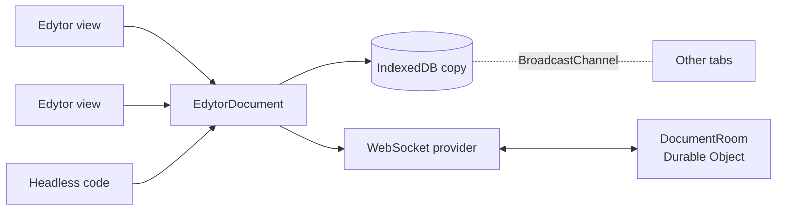

Every edytor document is a CRDT: edits from any number of views, tabs and people merge on their own, without a central lock and without losing work made offline. This section covers the document object, the providers that persist and transport it, presence, and the editing rules users see when they edit together.

## How it fits together

One document is one `EdytorDocument`. It owns the CRDT state, a document API (the facade), one undo history, one awareness instance for presence, and the local author identity. Views render it; providers keep it in sync.



- **The document** is created with `createDocument` or restored with `loadDocument`. It works with no view at all (Node, SSR, tests) or behind any number of `<Edytor>` views. See [Documents](/docs/collaboration/documents).
- **A sync** is a small factory, such as `createIndexeddbSync(name)` or `createWebsocketSync(options)`, that attaches a provider to the document. Pass it to `<Edytor sync={…}>` or to `document.attachSync(…)`. The provider lives as long as the document, not the view.
- **Awareness** carries presence: who is here, their name and color, and their selection. Every view and provider shares the document's single awareness instance. See [Presence](/docs/collaboration/presence).
- **The room** is `DocumentRoom`, a Cloudflare Durable Object that edytor ships. You deploy it on your own account; it authorizes sockets through your code, stores the document in SQLite and relays edits. See [Server](/docs/server/quick-start).

When two replicas meet, whether a tab and the server or two tabs, each tells the other what it already holds, and each sends back what the other lacks. There is no "last save wins": offline edits merge the next time a connection opens.

## Choose your setup

<CardGroup cols={3}>
  <Card title="Local only" href="/docs/collaboration/documents" icon="file-text">
    One browser, no persistence. Pass a `value` or a `document` and edit. Several views can share it.
  </Card>
  <Card title="IndexedDB" href="/docs/collaboration/persistence" icon="hard-drive">
    Keep the document in the browser. Survives reloads and syncs open tabs, with no server.
  </Card>
  <Card title="WebSocket room" href="/docs/collaboration/websocket" icon="radio-tower">
    Real-time editing between people through the Durable Object room, with a local copy for offline work.
  </Card>
</CardGroup>

### Local only

```svelte
<script lang="ts">
  import { Edytor, richTextPlugin } from 'edytor';

  const value = { children: [{ type: 'paragraph', content: [{ text: 'Hello' }] }] };
</script>

<Edytor {value} plugins={[richTextPlugin]} />
```

### IndexedDB

```svelte
<script lang="ts">
  import { Edytor, createIndexeddbSync, richTextPlugin } from 'edytor';

  const sync = createIndexeddbSync('notes/today');
</script>

<Edytor {sync} plugins={[richTextPlugin]} />
```

### WebSocket room

```svelte
<script lang="ts">
  import { Edytor, createWebsocketSync, richTextPlugin } from 'edytor';

  const sync = createWebsocketSync({
    serverUrl: 'wss://rooms.example.com/rooms',
    roomName: 'doc-42'
  });
</script>

<Edytor {sync} plugins={[richTextPlugin]} />
```

The WebSocket sync keeps a local IndexedDB copy by default, so the third setup also covers the second. A real deployment also sends a token; see the [server quick start](/docs/server/quick-start).

:::note
The `sync` prop is read once, when the view mounts, and only by editable views. A `readonly` view does not attach its `sync`; attach it to the document instead (see [Documents](/docs/collaboration/documents#attach-a-provider)).
:::

## In this section

<CardGroup cols={2}>
  <Card title="Documents" href="/docs/collaboration/documents" icon="file-text">
    `createDocument`, `loadDocument`, readiness, several views and headless use.
  </Card>
  <Card title="Persistence" href="/docs/collaboration/persistence" icon="hard-drive">
    IndexedDB, the local copy, offline behavior and cross-tab sync.
  </Card>
  <Card title="WebSocket" href="/docs/collaboration/websocket" icon="radio-tower">
    `createWebsocketSync` options, provider events, saved state and reconnects.
  </Card>
  <Card title="Presence" href="/docs/collaboration/presence" icon="mouse-pointer-2">
    User names and colors, remote carets and selections.
  </Card>
  <Card title="Concurrent editing" href="/docs/collaboration/concurrent-editing" icon="git-merge">
    What people see when they delete, undo, split and move at the same time.
  </Card>
  <Card title="Server" href="/docs/server/quick-start" icon="server">
    Deploy the Durable Object room in a few steps.
  </Card>
</CardGroup>
